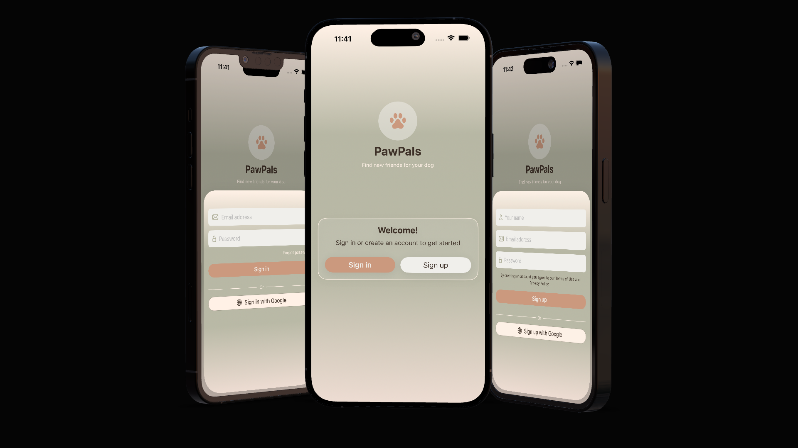
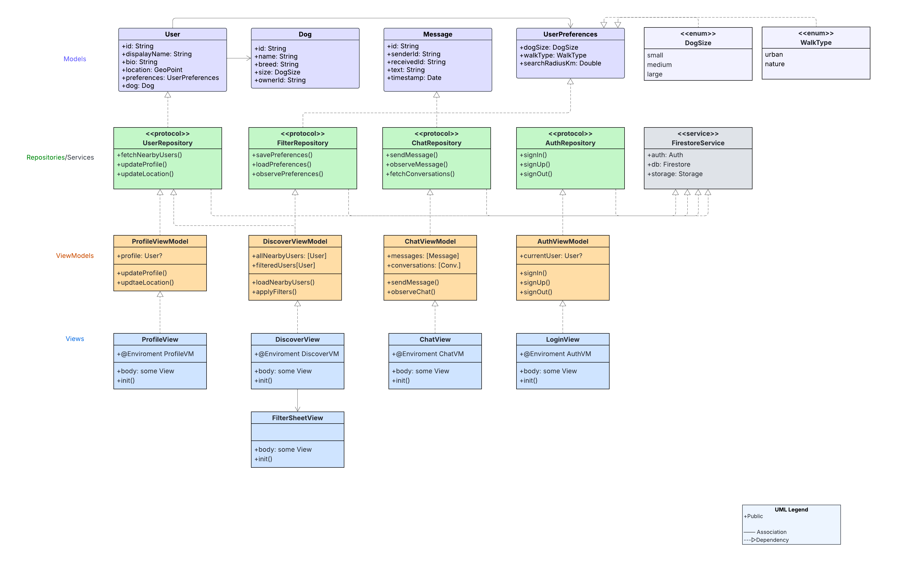
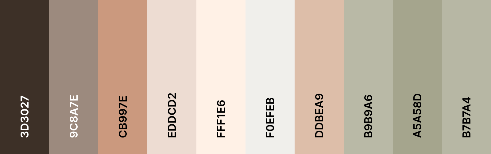

# PawPals



## Table of Contents
- [UX](#ux)
  - [App Purpose](#app-purpose)
  - [App Goal](#app-goal)
  - [Developer Goals](#developer-goals)
  - [User Goals](#user-goals)
  - [Audience](#audience)
  - [Communication](#communication)
  - [Interaction & Experience Principles](#interaction--experience-principles)
- [Agile Planning](#agile-planning)
  - [Epics & User Stories](#epics--user-stories)
  - [Implemented User Stories](#implemented-user-stories)
  - [Not Implemented User Stories](#not-implemented-user-stories)
  - [MoSCoW Prioritization](#moscow-prioritization)
  - [Kanban Board](#kanban-board)
  - [UML Diagram](#uml-diagram)
- [Design](#design)
  - [Prototype](#prototype)
  - [Colour Scheme](#colour-scheme)
  - [Fonts](#fonts)
- [Features](#features)
  - [Existing Features](#existing-features)
  - [Future Features](#future-features)
- [Testing](#testing)
  - [Manual Testing](#manual-testing)
  - [Bugs](#bugs)
  - [Unfixed Bugs](#unfixed-bugs)
- [Technologies](#technologies)
  - [Main Languages Used](#main-languages-used)
  - [Architecture](#architecture)
  - [Setup & Installation](#setup--installation)
- [Credits](#credits)

## UX

### App Purpose

PawPals is a social app for dog owners to find and connect with other dog owners nearby — for walks, playdates, and building a local community around shared dog ownership.

The app lets users create a profile for themselves and their dog(s), discover nearby dog owners based on location and shared walk preferences, save profiles they're interested in, and chat directly within the app.

### App Goal

The main goal is to make it easy and low-friction for dog owners to find compatible walking buddies nearby. The app should:
- Let users create and edit a profile with their own info and their dog(s)' info
- Let users set walk preferences and search radius
- Show nearby dog owners filtered by preferences, distance, and dog size
- Let users save/like profiles and start conversations
- Provide real-time chat between matched users
- Store all data in Firebase Firestore with authentication via Firebase Auth

### Developer Goals

To build a stable, well-structured, and polished iOS application using modern Swift development practices.

Specific goals include:
- Apply MVVM architecture with a clean separation of concerns
- Use protocol-driven repository/service layers for Firebase, making the backend swappable
- Use `@Observable` and `@Environment` for modern, clean state management
- Maintain clean, readable, and consistently styled code throughout
- Manage all work through GitHub with branches, pull requests, and meaningful commit history

### User Goals

Dog owners want to:
- Find other dog owners nearby with compatible walk preferences
- Set up a profile for themselves and their dog(s) quickly
- See relevant matches without endless scrolling
- Chat safely and easily with people they've matched with
- Save profiles they like and revisit them later

### Audience

PawPals is aimed at dog owners who want to meet other dog owners in their area — for walks, socializing dogs, or building a local network of dog-friendly contacts.

### Communication

The app communicates through a warm, neutral colour palette (terracotta, peach, cream, sand, sage) that feels friendly and approachable rather than clinical. Profile cards, tags, and chat bubbles use soft rounded shapes to keep the tone casual and welcoming.

### Interaction & Experience Principles

- **Minimal friction** — view a profile, save it, or start a chat in one or two taps
- **Relevant matches first** — filtering by distance, walk type, and dog size keeps suggestions useful
- **Consistent visual language** — warm neutral theme throughout, no jarring transitions
- **Real-time feedback** — chat updates and unread counts update live
- **Safety-aware** — users can block or report another profile

[Back to top](#pawpals)

## Agile Planning

The development of PawPals was planned using Agile methodology. All functionality was divided into Epics and refined into User Stories, each assigned a MoSCoW priority and tracked on a GitHub Projects Kanban board.

### Epics & User Stories
PawPals' functionality was broken down into 6 Epics, each representing a major area of the app. Every Epic was further refined into individual User Stories, each assigned a MoSCoW priority and tracked as a GitHub issue. Click "User Stories" under each Epic to expand the full list of linked issues.

#### EPIC 1 — Setup
Covers the foundational work that everything else builds on: the initial Xcode project structure, the app's navigation shell (tab bar), the design system (colors, constants, localization), and shared infrastructure such as mock repositories and the centralized FirestoreService for error handling.

[View Epic 1](https://github.com/Linnea87/pawpals/issues/36)

<details>
<summary>User Stories</summary>

- [[PP-001] Initial Xcode project setup & folder structure](https://github.com/Linnea87/pawpals/issues/1)
- [[PP-031] App navigation shell (tab bar)](https://github.com/Linnea87/pawpals/issues/31)
- [[PP-037] Rename color assets to descriptive, self-explanatory names](https://github.com/Linnea87/pawpals/issues/51)
- [[PP-039] Tab navigation shell to follow clean navigation flow](https://github.com/Linnea87/pawpals/issues/62)
- [[PP-051] Refactor Localizable.strings keys — replace underscores with dots](https://github.com/Linnea87/pawpals/issues/109)
- [[PP-056] Consolidate mock repositories into Core/Mocks/Mocks.swift](https://github.com/Linnea87/pawpals/issues/120)
- [[PP-058] Remove empty DTOs folder from project](https://github.com/Linnea87/pawpals/issues/124)
- [[PP-063] Extract magic numbers in TabBarView into named constants](https://github.com/Linnea87/pawpals/issues/131)
- [[PP-064] Add function comments and fix spacing in Repository protocols](https://github.com/Linnea87/pawpals/issues/135)
- [[PP-067] Clean up Constants — remove empty enum, add opacity tokens, fix magic numbers](https://github.com/Linnea87/pawpals/issues/143)
- [[PP-071] Rename id parameters to ID for consistency](https://github.com/Linnea87/pawpals/issues/153)
- [[PP-079] Standardize ViewModel naming to xxxVM across all views](https://github.com/Linnea87/pawpals/issues/173)
- [[PP-080] Add Swedish localization and clean up unused string keys](https://github.com/Linnea87/pawpals/issues/175)
- [[PP-083] Build out FirestoreService as centralized error handler and localize LocationService error strings](https://github.com/Linnea87/pawpals/issues/179)

</details>

#### EPIC 2 — Auth
Covers account creation, sign-in, sign-out, account deletion, and password reset using Firebase Auth (email/password and Google Sign-In). Includes fixes for sign-in flow bugs and error handling around sign-out.

[View Epic 2](https://github.com/Linnea87/pawpals/issues/37)

<details>
<summary>User Stories</summary>

- [[PP-002] Sign up with email & password](https://github.com/Linnea87/pawpals/issues/2)
- [[PP-003] Sign in with Email and Password or Google SSO](https://github.com/Linnea87/pawpals/issues/3)
- [[PP-004] Log out](https://github.com/Linnea87/pawpals/issues/4)
- [[PP-005] Delete account](https://github.com/Linnea87/pawpals/issues/5)
- [[PP-035] Reset password](https://github.com/Linnea87/pawpals/issues/35)
- [[PP-040] Fix sign-in flow blocking taps after authentication](https://github.com/Linnea87/pawpals/issues/78)
- [[PP-041] Handle errors in AuthViewModel.signOut](https://github.com/Linnea87/pawpals/issues/79)
- [[PP-047] Add logout confirmation alert (refactor of PP-004)](https://github.com/Linnea87/pawpals/issues/96)

</details>

#### EPIC 3 — Profile
Covers everything related to a user's own profile and their dog(s): adding personal info and photo, adding and editing dog details, setting walk preferences, persisting data across sessions, and viewing/managing saved profiles. Also includes the repository split (Profile vs. Meet) and fixes to ensure preferences and dog data are correctly loaded everywhere a profile is shown.

[View Epic 3](https://github.com/Linnea87/pawpals/issues/38)

<details>
<summary>User Stories</summary>

- [[PP-006] Add my dog information](https://github.com/Linnea87/pawpals/issues/6)
- [[PP-007] Add owner name & photo to profile](https://github.com/Linnea87/pawpals/issues/7)
- [[PP-008] Set walk preferences](https://github.com/Linnea87/pawpals/issues/8)
- [[PP-009] Edit profile & dog info](https://github.com/Linnea87/pawpals/issues/9)
- [[PP-010] Dismiss profile view with X button](https://github.com/Linnea87/pawpals/issues/10)
- [[PP-012] Add multiple dogs to profile](https://github.com/Linnea87/pawpals/issues/12)
- [[PP-036] Rename User.displayName to name across codebase](https://github.com/Linnea87/pawpals/issues/49)
- [[PP-044] Persist user data across logout and login (refactor of PP-007)](https://github.com/Linnea87/pawpals/issues/93)
- [[PP-045] Save profile photo from picker and show user name on profile card (refactor of PP-007)](https://github.com/Linnea87/pawpals/issues/94)
- [[PP-046] Reflect preferences in ProfileView immediately after save (refactor of PP-008)](https://github.com/Linnea87/pawpals/issues/95)
- [[PP-053] Extract AvatarView, SocialAuthButtons, and SectionHeader as reusable components](https://github.com/Linnea87/pawpals/issues/113)
- [[PP-062] Auto-fill city from GPS using reverse geocoding](https://github.com/Linnea87/pawpals/issues/130)
- [[PP-066] Split UserRepository into ProfileRepository and MeetRepository](https://github.com/Linnea87/pawpals/issues/141)
- [[PP-075] Refactor: Extract subviews from ProfileView and AddProfileSheet](https://github.com/Linnea87/pawpals/issues/163)
- [[PP-077] Open profile when tapping a saved profile card](https://github.com/Linnea87/pawpals/issues/169)
- [[PP-081] Fix fetchUser hardcoding empty preferences instead of decoding stored values](https://github.com/Linnea87/pawpals/issues/176)
- [[PP-088] Fix Meet size filter and missing dog in profile detail](https://github.com/Linnea87/pawpals/issues/191)

</details>

#### EPIC 4 — Meet
Covers discovering other dog owners nearby: requesting location permission, setting a search radius, browsing and filtering suggestions by walk type and dog size, viewing distances, and seeing nearby users on a map. Also includes saving/liking profiles, hiding profiles once a conversation has started, and several fixes to make the nearby-users query and filters behave correctly.

[View Epic 4](https://github.com/Linnea87/pawpals/issues/39)

<details>
<summary>User Stories</summary>

- [[PP-011] View another user's full profile](https://github.com/Linnea87/pawpals/issues/11)
- [[PP-013] Request location permission](https://github.com/Linnea87/pawpals/issues/13)
- [[PP-014] Set search radius](https://github.com/Linnea87/pawpals/issues/14)
- [[PP-015] Scrollable list of nearby profile suggestions](https://github.com/Linnea87/pawpals/issues/15)
- [[PP-016] Filter suggestions with quick-select pills](https://github.com/Linnea87/pawpals/issues/16)
- [[PP-017] Show distance to other dog owners](https://github.com/Linnea87/pawpals/issues/17)
- [[PP-018] Map view of nearby dog owners](https://github.com/Linnea87/pawpals/issues/18)
- [[PP-019] Filter by dog breed or size](https://github.com/Linnea87/pawpals/issues/19)
- [[PP-032] Activity feed](https://github.com/Linnea87/pawpals/issues/32)
- [[PP-033] Leave a review after a walk](https://github.com/Linnea87/pawpals/issues/33)
- [[PP-034] Save/like a profile](https://github.com/Linnea87/pawpals/issues/34)
- [[PP-043] Complete location permission flow (deferred from PP-013)](https://github.com/Linnea87/pawpals/issues/85)
- [[PP-048] Move filter pills into FilterSheetView (deferred from PP-016)](https://github.com/Linnea87/pawpals/issues/92)
- [[PP-050] Fix nearby users not loading from Firebase in MeetView (refactor of PP-015 + PP-017)](https://github.com/Linnea87/pawpals/issues/102)
- [[PP-052] Fix chat real-time listener, navigation bugs, and MeetView freeze](https://github.com/Linnea87/pawpals/issues/112)
- [[PP-054] Extract WalkTypeTag and FilterChip as reusable components](https://github.com/Linnea87/pawpals/issues/116)
- [[PP-055] Extract FilterViewModel and implement FilterRepository for filter state](https://github.com/Linnea87/pawpals/issues/117)
- [[PP-061] Extract location state into LocationViewModel](https://github.com/Linnea87/pawpals/issues/129)
- [[PP-065] Remove "Filter" and "Chat" navigation titles](https://github.com/Linnea87/pawpals/issues/138)
- [[PP-069] Fix MeetCardView cards to have a fixed width](https://github.com/Linnea87/pawpals/issues/147)
- [[PP-072] Hide profiles in Meet once a conversation has been started](https://github.com/Linnea87/pawpals/issues/156)
- [[PP-082] Decouple Meet repository & ViewModel from Firebase](https://github.com/Linnea87/pawpals/issues/177)
- [[PP-084] Make the radius slider drive the Meet fetch query](https://github.com/Linnea87/pawpals/issues/182)
- [[PP-086] Refactor fetchSavedProfiles to reuse fetchSavedProfileIDs](https://github.com/Linnea87/pawpals/issues/186)
- [[PP-087] Meet cleanup: slider save debounce + dead props](https://github.com/Linnea87/pawpals/issues/189)
- [[PP-088] Fix Meet size filter and missing dog in profile detail](https://github.com/Linnea87/pawpals/issues/191)

</details>

#### EPIC 5 — Chat
Covers starting conversations from a profile, the chat list with unread counts and favorites, real-time messaging including images, and the conversation view design. Also includes fixes for the real-time listener, navigation between Chat and Conversation, and message/date-grouping correctness.

[View Epic 5](https://github.com/Linnea87/pawpals/issues/40)

<details>
<summary>User Stories</summary>

- [[PP-020] Start a conversation from a profile](https://github.com/Linnea87/pawpals/issues/20)
- [[PP-021] Chat list — see all active conversations](https://github.com/Linnea87/pawpals/issues/21)
- [[PP-022] Send and receive text messages in real time](https://github.com/Linnea87/pawpals/issues/22)
- [[PP-023] Unread message badge count](https://github.com/Linnea87/pawpals/issues/23)
- [[PP-024] Timestamp on last sent message in chat list](https://github.com/Linnea87/pawpals/issues/24)
- [[PP-025] Read receipts](https://github.com/Linnea87/pawpals/issues/25)
- [[PP-026] Push notifications for new messages](https://github.com/Linnea87/pawpals/issues/26)
- [[PP-027] Suggest a walk in chat](https://github.com/Linnea87/pawpals/issues/27)
- [[PP-028] Share images in chat](https://github.com/Linnea87/pawpals/issues/28)
- [[PP-038] Implement ChatView real design — filter tabs, gradient and conversation row cards](https://github.com/Linnea87/pawpals/issues/56)
- [[PP-042] Message delivered state](https://github.com/Linnea87/pawpals/issues/81)
- [[PP-049] Match ConversationView to Figma design (refactor of PP-038)](https://github.com/Linnea87/pawpals/issues/99)
- [[PP-052] Fix chat real-time listener, navigation bugs, and MeetView freeze](https://github.com/Linnea87/pawpals/issues/112)
- [[PP-057] Notifications: code review](https://github.com/Linnea87/pawpals/issues/122)
- [[PP-059] Chat cleanup: localization, conversation ID, and filter logic](https://github.com/Linnea87/pawpals/issues/125)
- [[PP-060] Extract ConversationViewModel from ChatViewModel](https://github.com/Linnea87/pawpals/issues/126)
- [[PP-065] Remove "Filter" and "Chat" navigation titles](https://github.com/Linnea87/pawpals/issues/138)
- [[PP-068] Replace ChatView filter buttons with shared FilterChip component](https://github.com/Linnea87/pawpals/issues/145)
- [[PP-070] Show favorite conversations in ChatView](https://github.com/Linnea87/pawpals/issues/149)
- [[PP-073] Fix: Close ConversationView opened from Profile sheet X dismiss and switch to Chat tab](https://github.com/Linnea87/pawpals/issues/157)
- [[PP-074] Refactor: Extract CardStyle modifier and simplify ConversationRowView params](https://github.com/Linnea87/pawpals/issues/162)
- [[PP-076] Refactor: Extract sub-views from ConversationView into ConversationComponents](https://github.com/Linnea87/pawpals/issues/165)
- [[PP-078] Fix chat & conversation correctness bugs](https://github.com/Linnea87/pawpals/issues/170)
- [[PP-085] Move ChatView preview helper into Mocks](https://github.com/Linnea87/pawpals/issues/185)

</details>

#### EPIC 6 — Safety
Covers the safety features that let users control who they interact with: blocking another user and reporting a profile.

[View Epic 6](https://github.com/Linnea87/pawpals/issues/41)

<details>
<summary>User Stories</summary>

- [[PP-029] Block a user](https://github.com/Linnea87/pawpals/issues/29)
- [[PP-030] Report a profile](https://github.com/Linnea87/pawpals/issues/30)

</details>

### Implemented User Stories

84 out of 91 user stories were successfully implemented across all six epics — Setup, Auth, Profile, Meet, Chat and Safety. The remaining 7 are listed under Not Implemented User Stories below.

<details>
<summary>Show all 84 implemented user stories</summary>

- [[PP-001] Initial Xcode project setup & folder structure](https://github.com/Linnea87/pawpals/issues/1)
- [[PP-002] Sign up with email & password](https://github.com/Linnea87/pawpals/issues/2)
- [[PP-003] Sign in with Email and Password or Google SSO](https://github.com/Linnea87/pawpals/issues/3)
- [[PP-004] Log out](https://github.com/Linnea87/pawpals/issues/4)
- [[PP-005] Delete account](https://github.com/Linnea87/pawpals/issues/5)
- [[PP-006] Add my dog information](https://github.com/Linnea87/pawpals/issues/6)
- [[PP-007] Add owner name & photo to profile](https://github.com/Linnea87/pawpals/issues/7)
- [[PP-008] Set walk preferences](https://github.com/Linnea87/pawpals/issues/8)
- [[PP-009] Edit profile & dog info](https://github.com/Linnea87/pawpals/issues/9)
- [[PP-011] View another user's full profile](https://github.com/Linnea87/pawpals/issues/11)
- [[PP-012] Add multiple dogs to profile](https://github.com/Linnea87/pawpals/issues/12)
- [[PP-013] Request location permission](https://github.com/Linnea87/pawpals/issues/13)
- [[PP-014] Set search radius](https://github.com/Linnea87/pawpals/issues/14)
- [[PP-015] Scrollable list of nearby profile suggestions](https://github.com/Linnea87/pawpals/issues/15)
- [[PP-016] Filter suggestions with quick-select pills](https://github.com/Linnea87/pawpals/issues/16)
- [[PP-017] Show distance to other dog owners](https://github.com/Linnea87/pawpals/issues/17)
- [[PP-018] Map view of nearby dog owners](https://github.com/Linnea87/pawpals/issues/18)
- [[PP-019] Filter by dog breed or size](https://github.com/Linnea87/pawpals/issues/19)
- [[PP-020] Start a conversation from a profile](https://github.com/Linnea87/pawpals/issues/20)
- [[PP-021] Chat list — see all active conversations](https://github.com/Linnea87/pawpals/issues/21)
- [[PP-022] Send and receive text messages in real time](https://github.com/Linnea87/pawpals/issues/22)
- [[PP-023] Unread message badge count](https://github.com/Linnea87/pawpals/issues/23)
- [[PP-024] Timestamp on last sent message in chat list](https://github.com/Linnea87/pawpals/issues/24)
- [[PP-025] Read receipts](https://github.com/Linnea87/pawpals/issues/25)
- [[PP-026] Push notifications for new messages](https://github.com/Linnea87/pawpals/issues/26)
- [[PP-028] Share images in chat](https://github.com/Linnea87/pawpals/issues/28)
- [[PP-031] App navigation shell (tab bar)](https://github.com/Linnea87/pawpals/issues/31)
- [[PP-034] Save/like a profile](https://github.com/Linnea87/pawpals/issues/34)
- [[PP-036] Rename User.displayName to name across codebase](https://github.com/Linnea87/pawpals/issues/49)
- [[PP-037] Rename color assets to descriptive, self-explanatory names](https://github.com/Linnea87/pawpals/issues/51)
- [[PP-038] Implement ChatView real design — filter tabs, gradient and conversation row cards](https://github.com/Linnea87/pawpals/issues/56)
- [[PP-039] Tab navigation shell to follow clean navigation flow](https://github.com/Linnea87/pawpals/issues/62)
- [[PP-040] Fix sign-in flow blocking taps after authentication](https://github.com/Linnea87/pawpals/issues/78)
- [[PP-041] Handle errors in AuthViewModel.signOut](https://github.com/Linnea87/pawpals/issues/79)
- [[PP-042] Message delivered state](https://github.com/Linnea87/pawpals/issues/81)
- [[PP-043] Complete location permission flow](https://github.com/Linnea87/pawpals/issues/85)
- [[PP-044] Persist user data across logout and login](https://github.com/Linnea87/pawpals/issues/93)
- [[PP-045] Save profile photo from picker and show user name on profile card](https://github.com/Linnea87/pawpals/issues/94)
- [[PP-046] Reflect preferences in ProfileView immediately after save](https://github.com/Linnea87/pawpals/issues/95)
- [[PP-047] Add logout confirmation alert](https://github.com/Linnea87/pawpals/issues/96)
- [[PP-048] Move filter pills into FilterSheetView](https://github.com/Linnea87/pawpals/issues/92)
- [[PP-049] Match ConversationView to Figma design](https://github.com/Linnea87/pawpals/issues/99)
- [[PP-050] Fix nearby users not loading from Firebase in MeetView](https://github.com/Linnea87/pawpals/issues/102)
- [[PP-051] Refactor Localizable.strings keys — replace underscores with dots](https://github.com/Linnea87/pawpals/issues/109)
- [[PP-052] Fix chat real-time listener, navigation bugs, and MeetView freeze](https://github.com/Linnea87/pawpals/issues/112)
- [[PP-053] Extract AvatarView, SocialAuthButtons, and SectionHeader as reusable components](https://github.com/Linnea87/pawpals/issues/113)
- [[PP-054] Extract WalkTypeTag and FilterChip as reusable components](https://github.com/Linnea87/pawpals/issues/116)
- [[PP-055] Extract FilterViewModel and implement FilterRepository for filter state](https://github.com/Linnea87/pawpals/issues/117)
- [[PP-056] Consolidate mock repositories into Core/Mocks/Mocks.swift](https://github.com/Linnea87/pawpals/issues/120)
- [[PP-057] Notifications: code review](https://github.com/Linnea87/pawpals/issues/122)
- [[PP-058] Remove empty DTOs folder from project](https://github.com/Linnea87/pawpals/issues/124)
- [[PP-059] Chat cleanup: localization, conversation ID, and filter logic](https://github.com/Linnea87/pawpals/issues/125)
- [[PP-060] Extract ConversationViewModel from ChatViewModel](https://github.com/Linnea87/pawpals/issues/126)
- [[PP-061] Extract location state into LocationViewModel](https://github.com/Linnea87/pawpals/issues/129)
- [[PP-062] Auto-fill city from GPS using reverse geocoding](https://github.com/Linnea87/pawpals/issues/130)
- [[PP-063] Extract magic numbers in TabBarView into named constants](https://github.com/Linnea87/pawpals/issues/131)
- [[PP-064] Add function comments and fix spacing in Repository protocols](https://github.com/Linnea87/pawpals/issues/135)
- [[PP-065] Remove "Filter" and "Chat" navigation titles](https://github.com/Linnea87/pawpals/issues/138)
- [[PP-066] Split UserRepository into ProfileRepository and MeetRepository](https://github.com/Linnea87/pawpals/issues/141)
- [[PP-067] Clean up Constants — remove empty enum, add opacity tokens, fix magic numbers](https://github.com/Linnea87/pawpals/issues/143)
- [[PP-068] Replace ChatView filter buttons with shared FilterChip component](https://github.com/Linnea87/pawpals/issues/145)
- [[PP-069] Fix MeetCardView cards to have a fixed width](https://github.com/Linnea87/pawpals/issues/147)
- [[PP-070] Show favorite conversations in ChatView](https://github.com/Linnea87/pawpals/issues/149)
- [[PP-071] Rename id parameters to ID for consistency](https://github.com/Linnea87/pawpals/issues/153)
- [[PP-072] Hide profiles in Meet once a conversation has been started](https://github.com/Linnea87/pawpals/issues/156)
- [[PP-073] Fix: Close ConversationView opened from Profile sheet X dismiss and switch to Chat tab](https://github.com/Linnea87/pawpals/issues/157)
- [[PP-074] Refactor: Extract CardStyle modifier and simplify ConversationRowView params](https://github.com/Linnea87/pawpals/issues/162)
- [[PP-075] Refactor: Extract subviews from ProfileView and AddProfileSheet](https://github.com/Linnea87/pawpals/issues/163)
- [[PP-076] Refactor: Extract sub-views from ConversationView into ConversationComponents](https://github.com/Linnea87/pawpals/issues/165)
- [[PP-077] Open profile when tapping a saved profile card](https://github.com/Linnea87/pawpals/issues/169)
- [[PP-078] Fix chat & conversation correctness bugs](https://github.com/Linnea87/pawpals/issues/170)
- [[PP-079] Standardize ViewModel naming to xxxVM across all views](https://github.com/Linnea87/pawpals/issues/173)
- [[PP-080] Add Swedish localization and clean up unused string keys](https://github.com/Linnea87/pawpals/issues/175)
- [[PP-081] Fix fetchUser hardcoding empty preferences instead of decoding stored values](https://github.com/Linnea87/pawpals/issues/176)
- [[PP-082] Decouple Meet repository & ViewModel from Firebase](https://github.com/Linnea87/pawpals/issues/177)
- [[PP-083] Build out FirestoreService as centralized error handler and localize LocationService error strings](https://github.com/Linnea87/pawpals/issues/179)
- [[PP-084] Make the radius slider drive the Meet fetch query](https://github.com/Linnea87/pawpals/issues/182)
- [[PP-085] Move ChatView preview helper into Mocks](https://github.com/Linnea87/pawpals/issues/185)
- [[PP-086] Refactor fetchSavedProfiles to reuse fetchSavedProfileIDs](https://github.com/Linnea87/pawpals/issues/186)
- [[PP-087] Meet cleanup: slider save debounce + dead props](https://github.com/Linnea87/pawpals/issues/189)
- [[PP-088] Fix Meet size filter and missing dog in profile detail](https://github.com/Linnea87/pawpals/issues/191)

</details>

[Back to top](#pawpals)

### Not Implemented User Stories

The following 7 user stories remain open — they were not implemented within the scope of this project, as we decided they weren't needed right now:

- [[PP-010] Dismiss profile view with X button](https://github.com/Linnea87/pawpals/issues/10)
- [[PP-027] Suggest a walk in chat](https://github.com/Linnea87/pawpals/issues/27)
- [[PP-029] Block a user](https://github.com/Linnea87/pawpals/issues/29)
- [[PP-030] Report a profile](https://github.com/Linnea87/pawpals/issues/30)
- [[PP-032] Activity feed](https://github.com/Linnea87/pawpals/issues/32)
- [[PP-033] Leave a review after a walk](https://github.com/Linnea87/pawpals/issues/33)
- [[PP-035] Reset password](https://github.com/Linnea87/pawpals/issues/35)

[Back to top](#pawpals)

### MoSCoW Prioritization

| Priority | Description |
|----------|-------------|
| **Must Have** | Core setup, authentication, profile creation, location-based discovery, real-time chat |
| **Should Have** | Saved profiles, favorites, read receipts, push notifications, error handling |
| **Could Have** | Map view, breed/size filters, activity feed, reviews, reusable component refactors |
| **Won't Have** | <!-- TODO --> |

### Kanban Board
The project was organized using a [GitHub Projects Kanban board](https://github.com/Linnea87/pawpals/projects) with the following workflow:

**Backlog → Todo → In Progress → Done**

### UML Diagram
The UML diagram below was created early in the project to outline the planned MVVM architecture, core models, and data flow.

Since then, the project has evolved — for example, names like `DiscoverViewModel`/`DiscoverView` became `MeetViewModel`/`MeetView`, `UserRepository` was split into `ProfileRepository` and `MeetRepository`, and additional ViewModels (`ConversationViewModel`, `FilterViewModel`, `LocationViewModel`) and repositories were introduced as the app grew. The diagram should therefore be viewed as the original foundation and conceptual overview rather than an exact representation of the current codebase.



[Back to top](#pawpals)

## Design

### Prototype
The app was designed in [Figma](https://www.figma.com) before development began to illustrate the core layout and screen structure of the app. As the project evolved during development, the final implementation may differ from this illustration.


### Colour Scheme
The colour palette was generated with [Coolors](https://coolors.co/) and chosen to feel warm, neutral, friendly, calm, and inviting.

- **Terracotta** `#CB997E` — Primary buttons, active tab, tags
- **Peach Light** `#EDDCD2` — Backgrounds, cards
- **Cream** `#FFF1E6` — Input field backgrounds
- **Off White** `#F0EFEB` — Screen backgrounds
- **Sand** `#DDBEA9` — Secondary surfaces, avatars
- **Sage Dark** `#A5A58D` — App background gradient (dark end)
- **Sage Light** `#B7B7A4` — App background gradient (light end)



All colors are defined in `Theme.swift` and referenced via `Assets.xcassets`. No color is ever hardcoded in a view.

### Fonts
The app uses the system default **SF Pro** via SwiftUI's standard font system.

[Back to top](#pawpals)

## Features

### Existing Features
- **Sign In & Sign Up** — Firebase Auth with email/password and Google Sign-In.
- **Profile** — Create and edit a profile with name, photo, bio, dog(s), and walk preferences.
- **Meet / Discover** — Browse nearby dog owners filtered by distance, walk type, and dog size, with map view.
- **Saved Profiles** — Save/like profiles and revisit them from your own profile, with tap-to-open navigation.
- **Chat** — Real-time conversations with unread badges, favorites, and image sharing.
- **Safety** — Block and report other profiles.
- **Localization** — User-facing text managed in `Localizable.xcstrings`, with Swedish translations.
- **Error Handling** — Firebase operations wrapped in `do/try/catch`, surfaced via `.alert`.

### Future Features
- **Activity feed** of recent connections
- **Reviews** after a walk with another user
- **Push notifications** for new messages
- **Reset password** flow

[Back to top](#pawpals)

## Testing

### Manual Testing

| Feature Area | Description | Status |
|:---|:---|:---:|
| **Sign In / Sign Up** | Verified email/password and Google sign-in/sign-up flows, including error handling for invalid credentials | ✅ |
| **Log Out / Delete Account** | Verified logout confirmation alert and full account deletion with Firestore data cleanup | ✅ |
| **Profile Creation & Editing** | Verified creating/editing name, photo, bio, dog(s), and walk preferences, with changes reflected immediately | ✅ |
| **Multiple Dogs** | Verified adding, editing, and removing multiple dogs on one profile | ✅ |
| **Location Permission** | Verified location permission request flow and city auto-fill via reverse geocoding | ✅ |
| **Meet / Nearby Users** | Verified nearby dog owners load correctly from Firebase and display distance | ✅ |
| **Filters** | Verified filtering by walk type, dog size, and search radius updates the Meet results correctly | ✅ |
| **Map View** | Verified nearby users are plotted correctly on the map | ✅ |
| **Saved Profiles** | Verified saving/unsaving a profile and tapping a saved profile opens it in a sheet | ✅ |
| **View Full Profile** | Verified opening another user's full profile from Meet, Chat, and Saved Profiles shows correct dog and preference data | ✅ |
| **Start Conversation** | Verified starting a conversation from a profile and that the profile is hidden from Meet afterward | ✅ |
| **Chat List** | Verified conversation list, unread badges, timestamps, and favorites filter | ✅ |
| **Real-time Messaging** | Verified sending/receiving text messages and images updates in real time | ✅ |
| **Conversation Navigation** | Verified closing a conversation opened from a profile sheet returns correctly to the Chat tab | ✅ |
| **Block / Report** | Verified blocking and reporting a profile works as expected | ✅ |
| **Localization** | Verified all user-facing text displays correctly in English and Swedish | ✅ |
| **Error Handling** | Verified Firebase errors are caught and shown as alerts, not crashes, across all features | ✅ |

[Back to top](#pawpals)

### Bugs

- **Sign-in flow blocking taps after authentication (PP-040)** — Fixed by correcting the navigation/state handling after successful sign-in.
- **AuthViewModel.signOut not handling errors (PP-041)** — Fixed by wrapping sign-out in proper error handling.
- **Chat real-time listener, navigation bugs, and MeetView freeze (PP-052)** — Fixed by correcting the Firestore listener lifecycle and navigation state.
- **Chat & conversation correctness bugs (PP-078)** — Fixed grouping of date separators and preserved typed text on send failure.
- **fetchUser hardcoding empty preferences (PP-081)** — Fixed by decoding the stored `preferences` map instead of returning hardcoded defaults.
- **Radius slider not driving the Meet fetch query (PP-084)** — Fixed by wiring the slider value into the nearby-users query.
- **Meet size filter and missing dog in profile detail (PP-088)** — Fixed dog size filtering and missing dog data in profile view.

[Back to top](#pawpals)

### Unfixed Bugs

There are no known unfixed bugs in the current version.

[Back to top](#pawpals)

## Technologies

### Main Languages Used
- **Swift** — All application logic, ViewModels, services, and UI components
- **SwiftUI** — Declarative UI framework used throughout
- **String Catalog** — All user-facing text managed in `Localizable.xcstrings`

### Architecture
PawPals follows the **MVVM (Model-View-ViewModel)** architectural pattern with a Repository + Service layer for all Firebase communication.

````
PawPals/
├── Features/
│   ├── Auth/
│   │   ├── AuthView.swift
│   │   ├── AuthViewModel.swift
│   │   ├── SignInView.swift
│   │   └── SignUpView.swift
│   ├── Profile/
│   │   ├── ProfileView.swift
│   │   ├── ProfileViewModel.swift
│   │   ├── AddProfileSheet.swift
│   │   └── ProfileComponents/
│   ├── Meet/
│   │   ├── MeetView.swift
│   │   ├── MeetViewModel.swift
│   │   ├── MeetCardView.swift
│   │   ├── FilterSheetView.swift
│   │   ├── FilterViewModel.swift
│   │   └── LocationViewModel.swift
│   ├── Chat/
│   │   ├── ChatView.swift
│   │   └── ChatViewModel.swift
│   ├── Conversation/
│   │   ├── ConversationView.swift
│   │   ├── ConversationViewModel.swift
│   │   └── ConversationComponents/
│   └── Navigation/
│       └── AppNavigationView.swift
├── Core/
│   ├── Components/
│   ├── Models/
│   ├── Repositories/
│   ├── Mocks/
│   └── Resources/
└── Data/
    └── Services/
````

**Key architectural decisions:**
- **View** — Reads from ViewModels via `@Environment` and renders. Uses `@Bindable` locally only for two-way bindings.
- **ViewModel** — All business logic and Firebase calls, marked `@Observable`, owned with `@State` and injected via `@Environment`. Naming convention: `xxxVM`.
- **Repository** — Protocols only, no implementation.
- **Service** — Concrete Firebase implementations behind repository protocols. ViewModels never import Firebase directly.
- **Components** — `Core/Components/` contains shared UI pieces reused across multiple features (e.g. `AvatarView`, `FilterChip`, `TabBarView`). `Profile/` and `Conversation/` had large views that needed to be slimmed down — their extracted subviews aren't reused elsewhere, so they live in feature-local `ProfileComponents/` and `ConversationComponents/` folders instead of `Core/Components/`.

### Setup & Installation
1. Clone the repository: `https://github.com/Linnea87/pawpals`
2. Open `PawPals.xcodeproj` in **Xcode 16** or later
3. Add your own `GoogleService-Info.plist` from Firebase Console — the original is excluded via `.gitignore`
4. Enable **Firebase Auth** (Email/Password + Google), **Firestore**, and **Firebase Storage** in your Firebase project
5. Build and run on a physical iPhone or iOS Simulator running **iOS 17** or later

[Back to top](#pawpals)

## Credits

### Content

All application logic, UI, and design were created by:

- [Linnea87](https://github.com/Linnea87)
- [PatNoO](https://github.com/PatNoO)
- [RuthPaulsson](https://github.com/RuthPaulsson)
- [ahmadhayel](https://github.com/ahmadhayel)

### Media

- **Icons** — SF Symbols by [Apple](https://developer.apple.com/sf-symbols/)
- **App Design & Prototype** — Designed in [Figma](https://www.figma.com)
- **Colour Palette** — Generated with [Coolors](https://coolors.co/)
- **Mockup**: Generated using [DeviceFrames](https://deviceframes.com/).